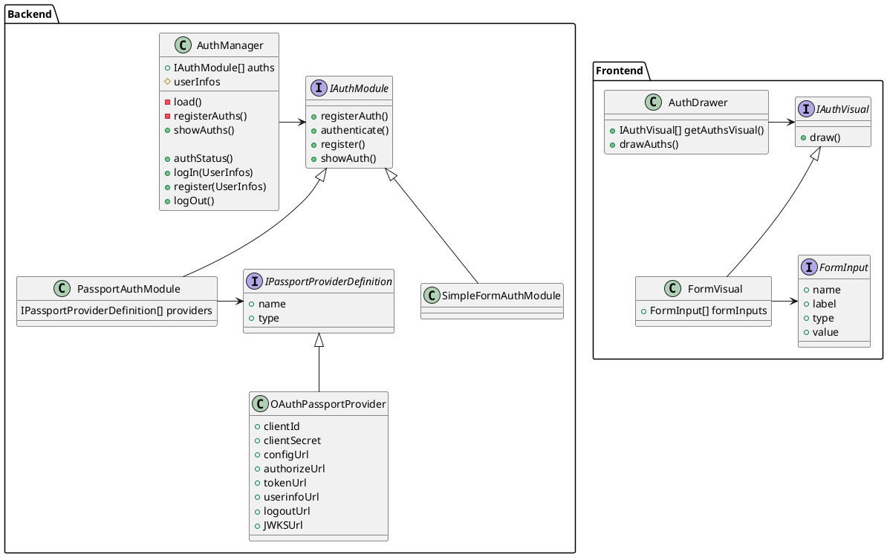
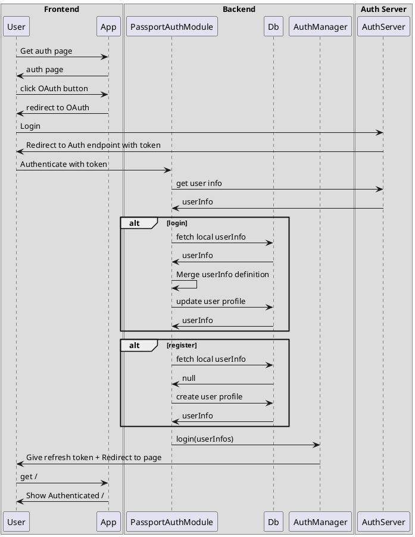
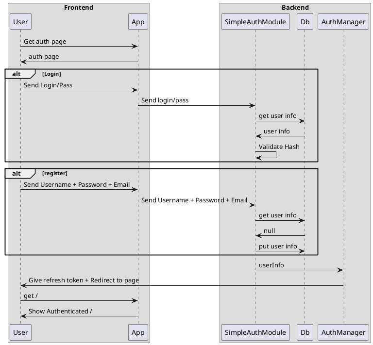
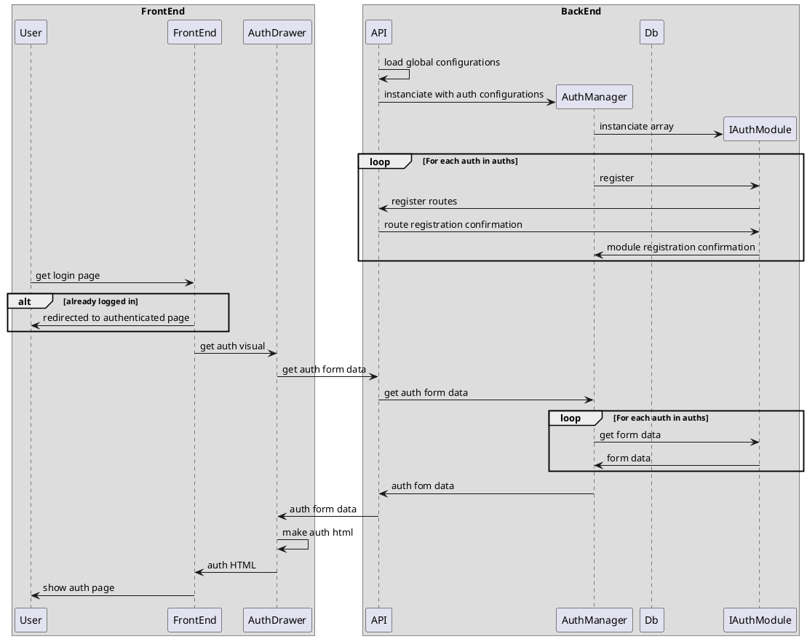
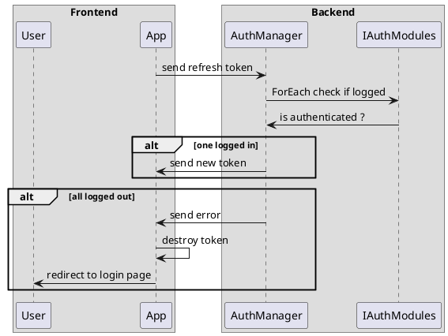

# Authentification

Le but du module d'authentification est de pouvoir facilement faire des blocks de code permettant une authentification personalisée. Il est possible de le faire grâce a cette architecture.

Le fonctionnement peut être expliqué avec les diagrammes suivants : 

## Module : Passport Js

## Module : SimpleAuth

## Comment les boutons sont affichés

## Comment les sessions sont conservées
