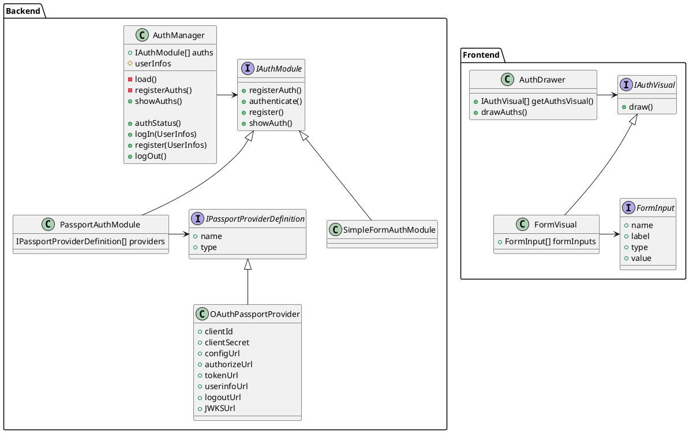
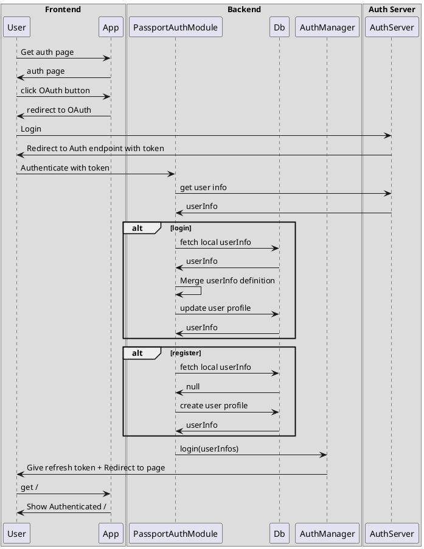
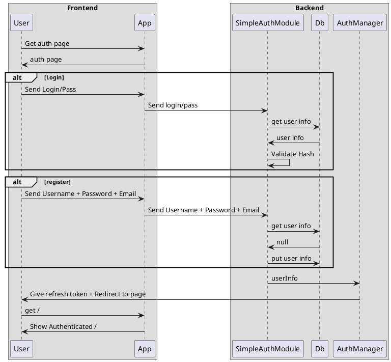
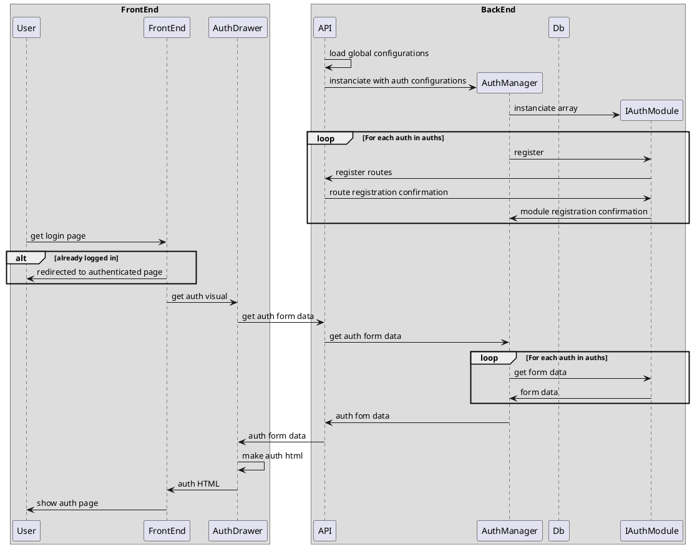
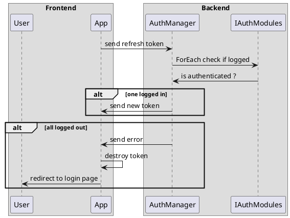

# Authentification

## Introduction

Le but du module d'authentification est de pouvoir facilement faire des blocs de code permettant une authentification 
personalisée. Il est possible de le faire grâce à cette architecture. Pour la première version de cette fonctionalité, 
l'introduction de OIDC et de OAuth sont priorisé ainsi que la migration du module d'authentification simple.


## Déconstruction simple de la structure
La structure est la suivante : 

Le AuthManager s'occupe de centraliser les requêtes d'authentification. Ce dernier initialise les autres modules et est
la source de vérité dans les aspects liés à l'authentification. Les modules sont automatiquement chargés par 
l'utilisation de variables d'environment.

Le module s'occupe de créer les routes nécessaires pour son fonctionnement et de créer les utilisateurs. Ces modules 
vont appeller le AuthManager afin de confirmer leurs actions avec le login/register de celui-ci.

Dans le cas de modules plus complexe, tels que le module Passport, la chaine peut être prolongée afin de maintenir 
les actions centralisée . Chaque connecteur de PassportJs est initialisé par le module de PassportJs.


## Besoins exprimés


Modularité et généricité : 

- Le système d'authentification doit être adaptable à diverses configurations, notamment pour répondre aux exigences 
spécifiques des différentes universités ou institutions. 

Utilisation de différentes méthodes d'authentification : 

- L'application doit permettre de gérer plusieurs fournisseurs d'authentification (SSO, LDAP, OAuth, etc.) de manière 
centralisée et flexible. 

Facilité de configuration : 

- Le système doit permettre une configuration simple et flexible, adaptée à différents environnements (développement, 
production, etc.). 

Gestion des permissions : 

- Il doit être possible de définir et de mapper facilement les permissions et les rôles des utilisateurs pour sécuriser 
l’accès aux différentes fonctionnalités de l’application. 

Maintien de la connexion : 

- Le système doit garantir la persistance de la connexion pendant toute la durée de l'utilisation de l'application 
(exemple : quiz), avec la possibilité de se reconnecter sans perte de données en cas de déconnexion temporaire. 

## Recits utilisateurs pris en comptes

- En tant qu'utilisateur de projet FOSS, je veux que le module d'authentification soit modulaire et générique afin de 
l'adapter à mes besoins. 
- En tant qu'administrateur, je veux que les droits des utilisateurs soient inférés par l'authentificateur de l'établissement.
- En tant qu'administrateur, je veux que la configuration des authentificateurs soit simple
- En tant qu'administrateur, je veux configurer les connexions à partir de variables d'environnement ou fichier de config.
- En tant qu'utilisateur, je veux que ma connexion soit stable.
- En tant qu'utilisateur, je veux pouvoir me reconnecter à une salle s'il survient un problème de connexion.

## Diagrammes

### Structure



### Explication des communications : Passport Js


### Explication des communications : SimpleAuth


### Comment les boutons sont affichés


### Comment les sessions sont conservées


## Configuration des variables d'environnement 

Example de configuration du fichier : `server/auth_config.json` :

```json
{
    "auth": {
        "passportjs": // Module
        [
            {
                "gmatte": { // Nom du sous-module Passport
                    "type": "oauth", // type
                    "OAUTH_AUTHORIZATION_URL": "https://auth.gmatte.xyz/application/o/authorize/",
                    "OAUTH_TOKEN_URL": "https://auth.gmatte.xyz/application/o/token/",
                    "OAUTH_USERINFO_URL": "https://auth.gmatte.xyz/application/o/userinfo/",
                    "OAUTH_CLIENT_ID": "--redacted--",
                    "OAUTH_CLIENT_SECRET": "--Redacted--",
                    "OAUTH_ADD_SCOPE": "groups", // scopes supplémentaire nécessaire pour le pivot
                    "OAUTH_ROLE_TEACHER_VALUE": "groups_evaluetonsavoir-prof", // valeur de pivot afin de définir un enseignant
                    "OAUTH_ROLE_STUDENT_VALUE": "groups_evaluetonsavoir" // valeur de pivot afin de définir un étudiant
                }
            },
            {
                "etsmtl":{
                    "type":"oidc",
                    "OIDC_CONFIG_URL":"https://login.microsoftonline.com/70aae3b7-9f3b-484d-8f95-49e8fbb783c0/v2.0/.well-known/openid-configuration",
                    "OIDC_CLIENT_ID": "--redacted--",
                    "OIDC_CLIENT_SECRET": "--redacted--",
                    "OIDC_ADD_SCOPE": "",
                    "OIDC_ROLE_TEACHER_VALUE": "groups_evaluetonsavoir-prof",
                    "OIDC_ROLE_STUDENT_VALUE": "groups_evaluetonsavoir"
                }
            }
        ],
        "simpleauth":{}
    }
}
```