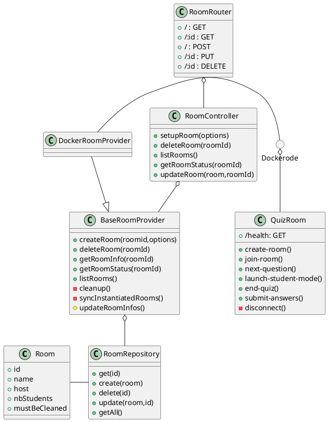
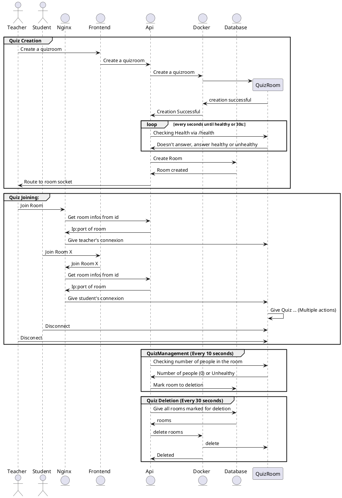

# Salles de Quiz

## Introduction

Les salles de quiz ont été extraites dans leur propre container afin de limiter les dégats liés soit a une surutilisation d'une salle ou une attaque sur le logiciel.

En éffet, le découplement permet a un quiz de: 

 - Survivre même si le backend est non-fonctionnel
 - Mourir sans entrainer toute l'application avec elle
 - Créer/Supprimer des salles automatiquement dépendant de la demande

 Pour éffectuer ceci il faut éffectuer une petite gymnastique. Il y a une route dans l'api servant à gerer les salles. Lorsqu'un utilisateur demande le socket d'une salle : "/api/rooms/{id}/socket", la requette rebondit sur le proxy Nginx. Celui-ci contacte le backend afin d'obtenir l'addresse de l'ordinateur auquel envoyer la requette et redirige le socket vers ce pc.

## Déconstruction simple de la structure

Un module supplémnetaire a été ajouté à la structure : Rooms.

L'objet `room` est la définition d'une salle de façon minimaliste, cette définission est aggrandie avec l'information récotlé du "provider".
Le `provider` est le système gérant les différentes salles. Dans l'implémentation éffectuée, il s'agit de docker.

Lorsque l'api des salles est instantié, celui-ci est lié avec un "provider", définissant comment les salles seront créées.
L'api des salles permet de les ajouter, les supprimer, et les consulter les salles.

L'api lance deux "jobs":

- Une vérification de l'état de santé des salles. Celle-ci roule tous les 10 secondes et met a jour les salles.
- Une suppression des salles. Celle-ci roule tous les 30 secondes et supprimme automatiquement les salles ayant la mention de suppression.

## Besoins exprimés

Fiabilite : 

- Nous voulons s'assurer qu'il soit possible d'avoir un grand nombre d'élèves présent sans qu'il y ait des problèmes de déconnexions
- Nous voulons que le temps de réponse soit bas 
- Nous voulons que le système soit capable de fonctionner de facon indépendante

## Recis utilisateurs pris en comptes

- En tant qu'enseignant, je veux que tous mes élèves soient capable de se connecter a la salle de classe rapidement
- En tant qu'enseignant, je veux que la salle de quiz puisse survivre des pannes liées aux autres modules de l'aplication
- En tant qu'administrateur, je veux que les salles soient indépendantes et qui ne touche pas aux performances des autres salles
- En tant qu'administrateur, je veux que les salles puissent être hébergées séparément du projet

## Diagrammes

### Structure

Remarque:  Les signatures de fonctions semblent un peu partout car il y a des fonctions de classes standard, des appels HTTPS et des appels de sockets dans le même diagramme.

### Diagramme de séquence démontrant les communications

## API

<swagger-ui src="/swagger/salle-de-quiz.json"/>
