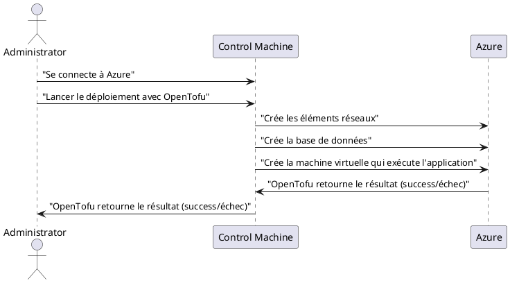

# Documentation de déploiement avec OpenTofu

Ce guide explique comment **OpenTofu** est utilisé pour déployer facilement le projet **ÉvalueTonSavoir**.

## Déploiement

### Étapes à réaliser pour faire le déploiement

Pour déployer à l'aide de OpenTofu, il suffit de suivre les étapes du fichier [README.md](https://github.com/ets-cfuhrman-pfe/EvalueTonSavoir/blob/main/opentofu/README.md).

### Structure des fichiers utilisés pour le déploiement sur Azure
- **`app.tf`** : Défini les configurations de la machine virtuelle qui exécute l'application.
- **`database.tf`** : Défini les configurations de la base de données.
- **`main.tf`** : Défini le fournisseur utilisé pour le déploiement, dans ce cas-ci Azure.
- **`network.tf`** : Défini les configurations réseau et les règles de sécurité réseau.
- **`resource_group.tf`** : Défini les configurations du groupes de ressources dans Azure.
- **`storage.tf`** : Défini les configurations pour stocker et pouvoir utiliser le fichier auth_config.json.
- **`terraform.tfvars`** : Défini les valeurs des variables à utiliser lors du déploiement. 
- **`variables.tf`** : Défini toutes les variables qui sont utilisées lors du déploiement.

### Étapes effectuées par OpenTofu
1. **Création des éléments du réseau** :
   - Création d'un réseau virtuel.
   - Création d'un sous-réseau.
   - Création d'une adresse ip publique.
   - Création d'un groupe de sécurité réseau.
   - Création d'une interface réseau.
2. **Création de la base de données** :
   - Création du serveur de base de données.
   - Création de la base de données (collection puisqu'on utilise MongoDB)
3. **Création de la machine virtuelle** :
   - Création de la machine virtuelle.
     - Installation de Docker
     - Récupération du fichier `docker-compose.yaml` depuis le dépôt Github.
     - Exécution de l'application avec le fichier `docker-compose.yaml`

## Résumé

Le déploiement avec **OpenTofu** simplifie la gestion des éléments nécessaires pour déployer le projet
**ÉvalueTonSavoir**. dans l'infonuagique. Avec cette méthode, vous pouvez déployer rapidement et facilement 
l'application dans un environnement infonuagique.

## Diagramme de sequence

