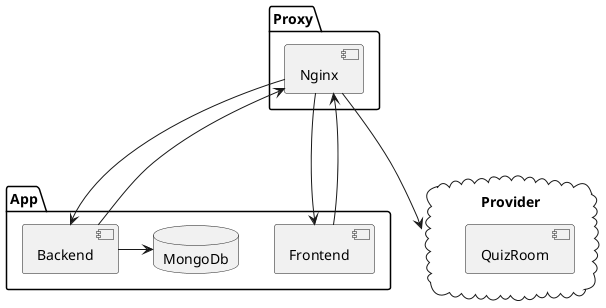

# Structure haut niveau

## But du projet
ÉvalueTonSavoir a été créer dû aux gros coûts des versions entreprises des logiciels similaires tels que Socrative et Kahoot. Le bût principal est d’être capable d’avoir une plateforme auto-hébergée et bien intégrée dans les systèmes déjà présents des établissements scolaire.

## Requis

Le but du projet étant un outils gratuis/libre afin d'améliorer l'apprentissage, celui-ci a les bûts suivants :

- Permettre aux personnels enseignant de créer des tests
- Permettre aux enseignant de collecter les résultats des tests
- Permettre aux étudiants de prendre ces tests
- Permettre aux étudiants d'avoir une rétroaction

Afin de limiter le niveau de difficulté d'intégration du personnel enseignant:

- L'utilisation du format [`GIFT`](https://docs.moodle.org/405/en/GIFT_format) déja présent dans moodle doit être utilisé
- Le personnel et les étudiants doivent être capable de s'authentifier avec le portail de l'école
- Le démarage du quiz doit se faire de facon rapide et éfficace.

Afin de faciliter le déploiement de masse : 

- Le logiciel doit être facile a déployer sur des machines locales
- Le logiciel doit être facile a déployer sur le cloud
- Le logiciel doit s'interconnecter à l'infrastructure présente
- Le logiciel doit être performant et fiable

## Architecture actuelle

### Details techniques

Le tableau ci-dessus est simplifié grandement car toutes les composantes sont individuelles. Ce qui veux dire qu'une toutes les parties pouraient être déployé sur un serveur différent et tout de même fonctionner, permettant de distribuer la charge de travail facilement.

Le proxy Nginx permet de camoufler la séparation du backend et frontend en réunissant les deux parties sous la même url. Il a aussi la tache de diriger les appels de sockets vers leurs machine interne dans le provider.

Le frontend déssert la partie visuel de l'application.

Le backend s'occupe de tous les services tel quel : 

- La gestion des utilisateurs
- La gestion des quizs
- La gestion des médias
- La gestion des salles

### Liens vers détails supplémentaires
- [Gestion de l'authentification](./backend/auth.md)
- [Gestion de la salle de Quiz](./backend/salle-de-quiz.md)