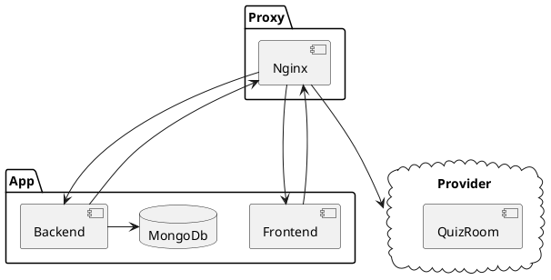

# Structure haut niveau

## But du projet
ÉvalueTonSavoir a été créé dû aux coûts importants des versions entreprises des logiciels similaires tels que Socrative et 
Kahoot. Le but principal est d’être capable d’avoir une plateforme auto-hébergée et bien intégrée dans les systèmes 
déjà présents des établissements scolaire.

## Requis

Le but du projet est d'avoir un outil gratuit et libre afin d'améliorer l'apprentissage avec les fonctionnalités suivantes :

- Permettre aux personnel enseignant de créer des quizs
- Permettre aux enseignant de collecter les résultats des quizs
- Permettre aux étudiants de faire ces quizs
- Permettre aux étudiants d'avoir une rétroaction

Afin de limiter le niveau de difficulté d'intégration du personnel enseignant:

- L'utilisation du format [`GIFT`](https://docs.moodle.org/405/en/GIFT_format) déja présent dans moodle doit être utilisé
- Le personnel et les étudiants doivent être capable de s'authentifier avec le portail de l'école
- Le démarrage du quiz doit se faire de façon rapide et efficace.

Afin de faciliter le déploiement de masse : 

- Le logiciel doit être facile a déployer sur des machines locales
- Le logiciel doit être facile a déployer sur le cloud
- Le logiciel doit s'interconnecter à l'infrastructure présente
- Le logiciel doit être performant et fiable

## Architecture actuelle

### Details techniques

Le tableau ci-dessus est simplifié grandement car toutes les composantes sont individuelles. Ce qui veut dire que chacune
des parties pouraient être déployées sur un serveur différent et tout de même fonctionner. Ceci permettrai de distribuer
la charge de travail facilement entre plusieurs serveurs.

Le proxy Nginx permet de camoufler la séparation du backend et frontend en réunissant les deux parties sous la même url. 
Il a aussi la tâche de diriger les appels de sockets vers leur machine interne dans le provider.

Le frontend dessert la partie visuelle de l'application.

Le backend s'occupe de tout les services suivants : 

- La gestion des utilisateurs
- La gestion des quizs
- La gestion des médias
- La gestion des salles

### Liens vers détails supplémentaires
- [Gestion de l'authentification](./backend/auth.md)
- [Gestion de la salle de Quiz](./backend/salle-de-quiz.md)