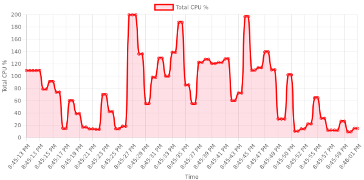

# Tests de Charge

Pour tester la montée en charge et les performances du projet, un **test de charge** est inclus dans `test/stressTest`. Il est conçu spécifiquement pour **evalue-ton-savoir**, avec un focus sur les communications serveur-client et client-client.

---

## Routes utilisé sur le quizRoom
- **`get-usage`** : Récupère les ressources des conteneurs du réseau.
- **`message-from-teacher`** : Transfert de messages des professeurs aux étudiants.
- **`message-from-student`** : Transfert de messages des étudiants aux professeurs.

---

## Fonctionnement

1. **Authentification** : Récupère un token depuis l’API backend.
2. **Configuration** : Crée les salles de quiz et connecte un professeur à chaque salle.
3. **Connexion des étudiants** : Connecte les étudiants aux salles selon les paramètres.
4. **Simulation** : Messages simulés entre professeurs et étudiants.
5. **Collecte des données** : Collecte les métriques de ressources pour analyse.

---

## Exécution

L'exécution des commandes doit se faire ici: `/test/stressTest`

### Directe

```bash
node main.js
```
- Node.js doit être installé.
- Modifiez les variables dans main.js.

### Docker

```bash
docker-compose up
```
- Docker doit être installé.
- Configurez un fichier .env.


## Variables d’Environnement

Les variables sont définies dans un fichier `.env` :

- **BASE_URL** : URL à tester.
- **USER_EMAIL**, **USER_PASSWORD** : Identifiants pour créer et gérer les salles.
- **NUMBER_ROOMS** : Nombre de salles.
- **USERS_PER_ROOM** : Nombre d’étudiants par salle.

### Variables Optionnelles
- **MAX_MESSAGES_ROUND** : Nombre maximum de messages par cycle.
- **CONVERSATION_INTERVAL** : Délai (ms) entre les messages.
- **MESSAGE_RESPONSE_TIMEOUT** : Délai (ms) avant de considérer un message sans réponse.
- **BATCH_DELAY** : Délai (ms) entre les envois par lots.
- **BATCH_SIZE** : Taille des lots de messages.

---

## Résultats Collectés

### Métriques
- **Salles créées / échouées**
- **Utilisateurs connectés / échoués**
- **Messages tentés, envoyés, reçus**

### Rapports
- **JSON** : Pour analyse automatisée.
- **Rapport texte** : Résumé lisible.
- **Graphiques** *(via ChartJS)* :
  - **CPU**, **mémoire**, **charge**.


### Exemple graphique: 

